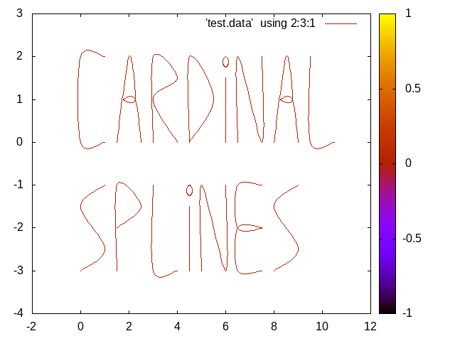

# cardinalsplines
Generic c++ function to build a cardinal spline from a sequence of points.


```
$ git clone https://github.com/FDePourcq/cardinalsplines.git
Cloning into 'cardinalsplines'...
remote: Enumerating objects: 7, done.
remote: Counting objects: 100% (7/7), done.
remote: Compressing objects: 100% (7/7), done.
remote: Total 7 (delta 1), reused 6 (delta 0), pack-reused 0
Unpacking objects: 100% (7/7), done.
$ cd cardinalsplines/
$ mkdir bin
$ cd bin
$ cmake .. .
-- The C compiler identification is GNU 9.2.1
-- The CXX compiler identification is GNU 9.2.1
-- Check for working C compiler: /usr/bin/cc
-- Check for working C compiler: /usr/bin/cc -- works
-- Detecting C compiler ABI info
-- Detecting C compiler ABI info - done
-- Detecting C compile features
-- Detecting C compile features - done
-- Check for working CXX compiler: /usr/bin/c++
-- Check for working CXX compiler: /usr/bin/c++ -- works
-- Detecting CXX compiler ABI info
-- Detecting CXX compiler ABI info - done
-- Detecting CXX compile features
-- Detecting CXX compile features - done
-- Configuring done
-- Generating done
-- Build files have been written to: /tmp/cardinalsplines/bin
$ make 
Scanning dependencies of target cardinalsplines
[ 50%] Building CXX object CMakeFiles/cardinalsplines.dir/main.cpp.o
[100%] Linking CXX executable cardinalsplines
[100%] Built target cardinalsplines
$ make gnuplot
[100%] Built target cardinalsplines
Scanning dependencies of target gnuplot
Warning: empty cb range [0:0], adjusting to [-1:1]
``` :


